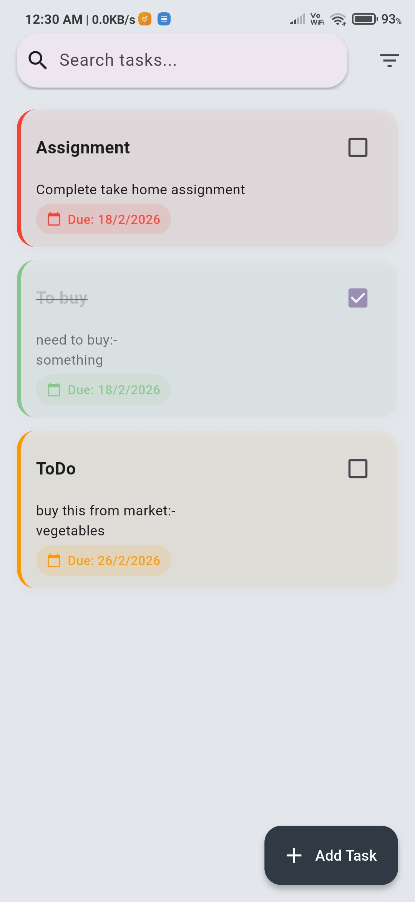
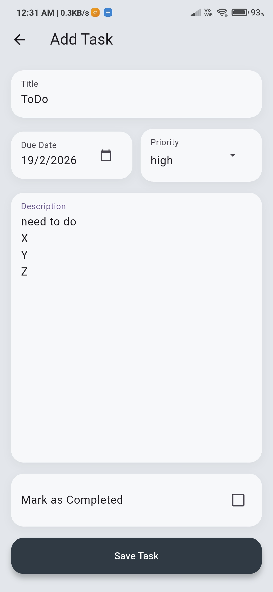
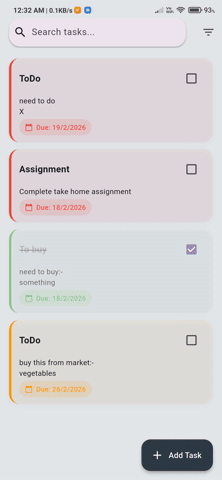
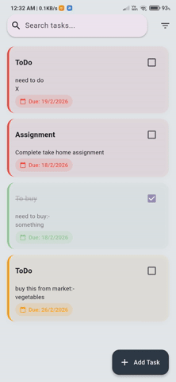

# Offline-First Task Manager App

---

## 📌 Overview

This project is an offline-first Task Manager mobile application built using Flutter. The primary focus of this implementation is clean architecture, separation of concerns, state management, and code quality rather than feature overload.

The application allows users to create, edit, delete, filter, and search tasks with full local persistence and a polished user experience.

---

## 🎯 Objective

To build a Flutter application that:

• Works completely offline  
• Persists data between app launches  
• Demonstrates clean architecture principles  
• Uses proper state management  
• Maintains clear separation of concerns  
• Provides a smooth and consistent UI experience  

---

## ✨ Features

### ✅ Task Management

Users can:

• Create a task  
• Edit a task  
• Delete a task  
• Mark a task as completed  
• Filter tasks  
• Search tasks by title  

Each task contains:

• Title (required)  
• Description (optional)  
• Due Date (optional)  
• Priority (low / medium / high)  
• Completion status  

---

### ✅ Offline Support

• All tasks are stored locally using Hive  
• Data persists between app launches  
• No backend or network dependency  

---

### ✅ Filtering

Users can filter tasks by:

• All tasks  
• Completed tasks  
• Pending tasks  

Filtering is handled via a dedicated use case and repository layer.

---

### ✅ Search 

• Search tasks by title  
• Integrated with filtering  
• Dynamically updates based on current state  

---

### ✅ Swipe to Delete

• Swipe gesture using Slidable  
• Animated dismissal  
• State updated via Bloc  

---

### ✅ Animations

• Animated task removal via swipe  
• Animated list updates using AnimatedSwitcher  
• Smooth screen transitions  

---

## 🏗 Architecture

This project follows a clean architecture approach with three primary layers:

### 1️⃣ Presentation Layer

Contains:

• Screens  
• Widgets  
• Bloc (state management)  

Responsibilities:

• UI rendering  
• Event handling  
• Reacting to state changes  

No business logic is placed inside UI widgets.

---

### 2️⃣ Domain Layer

Contains:

• Entities  
• Repository interface  
• Use cases  

Responsibilities:

• Business logic  
• Application rules  
• Independent of framework and data sources  

Each use case is implemented as a separate class to maintain single responsibility.

---

### 3️⃣ Data Layer

Contains:

• Repository implementation  
• Local data source  
• Models  
• Hive adapters  

Responsibilities:

• Data persistence  
• Entity-model conversion  
• Interaction with Hive  

---

## 🔁 Data Flow
```

UI → Bloc → Use Case → Repository → Data Source → Hive  

Hive → Data Source → Repository → Use Case → Bloc → UI  
```

This ensures strict separation between layers.

---

## 📂 Project Structure
```
lib  
│  
├── data  
│   ├── datasource  
│   ├── models  
│   └── repository  
│  
├── domain  
│   ├── entities  
│   ├── repository  
│   └── usecases  
│  
├── presentation  
│   ├── bloc  
│   ├── screens  
│   └── widgets  
│  
└── main.dart  
```
---

## 🧠 State Management

The application uses Bloc for state management.

States implemented:

• Loading state  
• Empty state  
• Loaded state  
• Error state  
• Task added state  
• Task updated state  
• Task deleted state  

This ensures predictable UI updates and clear state transitions.

---

## 🧪 Code Quality Considerations

• Null safety enabled  
• Lints enabled  
• Meaningful naming conventions  
• Clear separation of concerns  
• Feature-based commit history  
• No business logic inside widgets  
• Consistent formatting  

---

## ⚖ Architectural Decisions

### Why Hive?

• Lightweight  
• Fast local storage  
• Simple key-value persistence  
• No complex schema required  

### Why Clean Architecture?

• Maintainability  
• Scalability  
• Testability  
• Clear boundaries between layers  

### Why Bloc?

• Predictable state transitions  
• Explicit event-driven architecture  
• Separation between UI and business logic  

---

## 🔄 Trade-offs

• Filtering is performed at the data layer for simplicity  
• Undo functionality was intentionally excluded to keep scope aligned with core architecture focus  
• No sorting implemented to avoid feature overloading  

The focus was placed on architecture, correctness, and maintainability.

---

## 📸 Screenshots & Demo

### Task List Screen

<p>
  
</p>


### Add / Edit Task Screen

<p>
  
</p>


### Search Functionality



### Swipe to Delete Animation



---

## 🚀 Setup Instructions

1. Install Flutter (latest stable version recommended)  
2. Clone the repository  
3. Run flutter pub get  
4. Run flutter run  

To build release APK:

flutter build apk --release  

---

## 📦 Optional APK Installation

If you prefer to directly install the release APK:

Download the APK from the link below and install it on your Android device:

https://github.com/denimsahu/TaskManager/releases/latest


---

## 🛠 Dependencies Used

• flutter_bloc  
• hive  
• hive_flutter  
• flutter_slidable  
• uuid  

---

## 📌 Final Notes

This project was built with a strong emphasis on:

• Architecture clarity  
• Code readability  
• Maintainability  
• Proper state management  
• Clean separation of concerns  

The goal was not to over-engineer but to demonstrate structured thinking and solid Flutter fundamentals.
